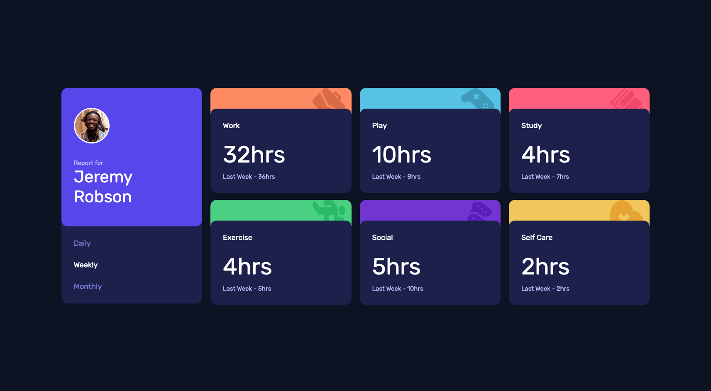
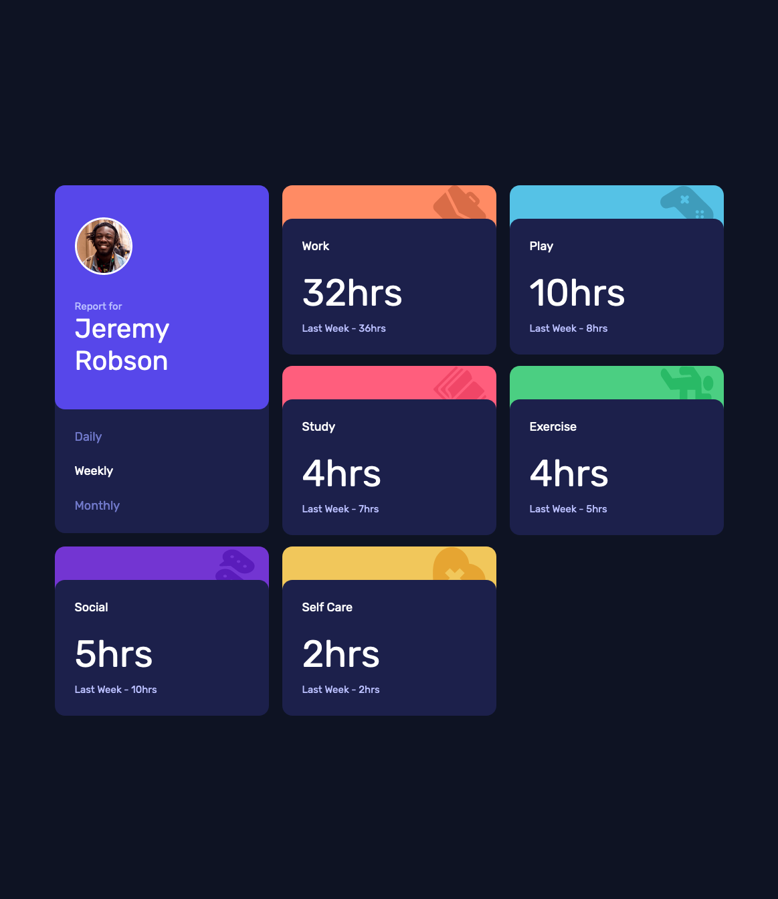
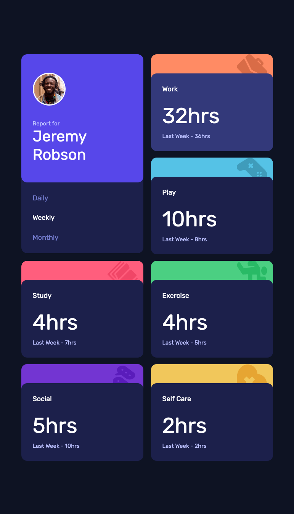
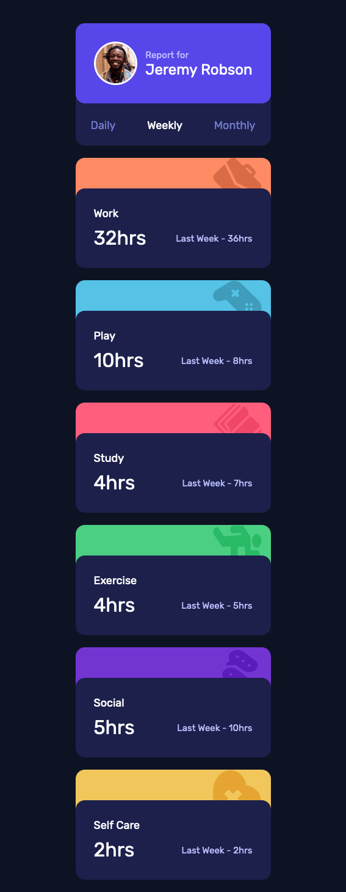

# Frontend Mentor - Time tracking dashboard solution

This is a solution to the [Time tracking dashboard challenge on Frontend Mentor](https://www.frontendmentor.io/challenges/time-tracking-dashboard-UIQ7167Jw). Frontend Mentor challenges help you improve your coding skills by building realistic projects. 

## Table of contents

- [Overview](#overview)
  - [The challenge](#the-challenge)
  - [Screenshots](#screenshots)
  - [Links](#links)
- [My process](#my-process)
  - [Built with](#built-with)
  - [What I learned](#what-i-learned)
  - [What gave me the most trouble](#what-gave-me-the-most-trouble)
  - [Continued development](#continued-development)
- [Author](#author)

**Note: Delete this note and update the table of contents based on what sections you keep.**

## Overview

### The challenge

Users should be able to:

- View the optimal layout for the site depending on their device's screen size
- See hover states for all interactive elements on the page
- Switch between viewing Daily, Weekly, and Monthly stats

### Screenshots

### Links

- Solution URL: [https://github.com/landot/time-tracking-dashboard](https://github.com/landot/time-tracking-dashboard)
- Live Site URL: [https://timothyl-portfolio-time-tracking-dash.netlify.app/](https://timothyl-portfolio-time-tracking-dash.netlify.app/)

## My process

### Built with

- Semantic HTML5 markup
- CSS custom properties
- Flexbox
- CSS Grid
- [Vite](https://vitejs.dev/) - JS library
- [React](https://reactjs.org/) - JS library
- [Styled Components](https://styled-components.com/) - For styles

### What I learned

- How to use CSS grid to create a responsive page
- How to create cards with an overlay component
- How to use media queries to update mobile styling

### What gave me the most trouble

- learning about absolute vs. relative positioning
- styling the CSS grid so that the Profile card can fit properly was difficult. There were some times where the Category cards were X pixels too high due to the overlay on the category cards

### Continued development

This project made me realize that I needed more experience with creating divs and properly styling pages so that they are mobile and desktop friendly. I also need to work more on absolute vs relative positioning.

## Author

- Website - [https://github.com/landot](https://github.com/landot)
- Frontend Mentor - [@landot](https://www.frontendmentor.io/profile/landot)

